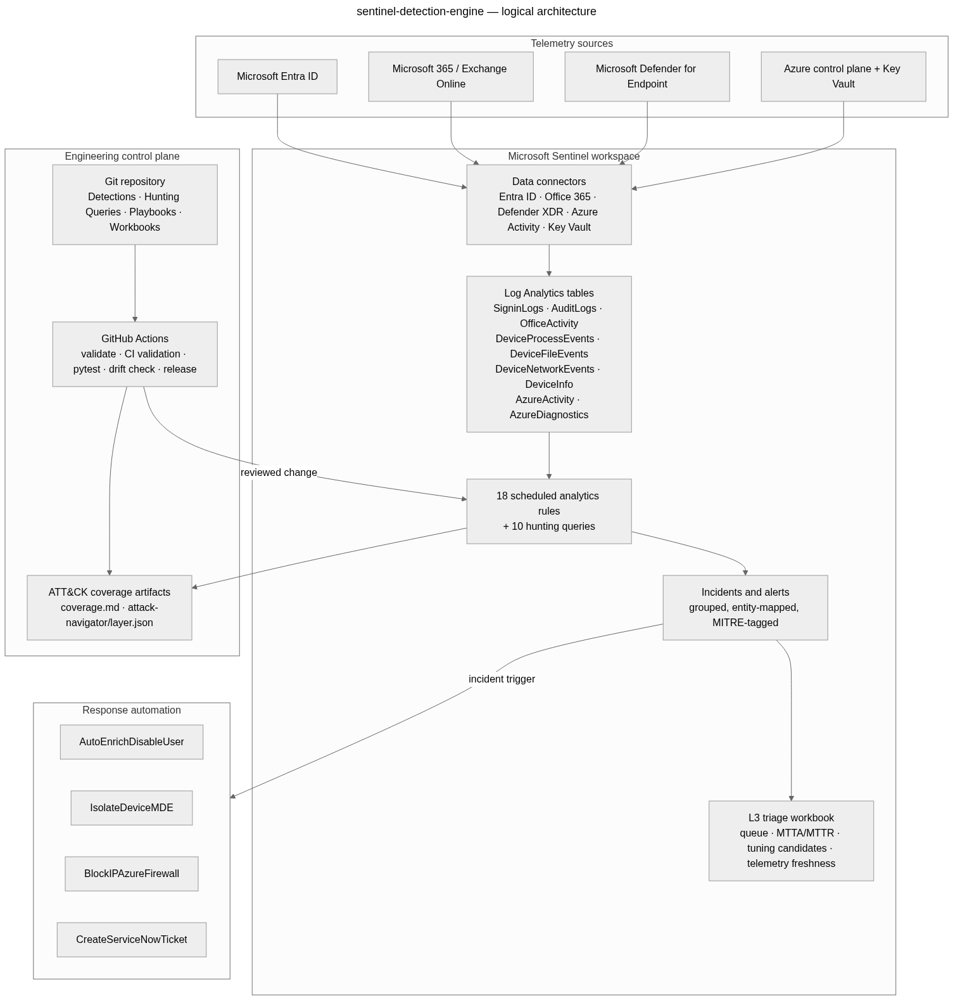
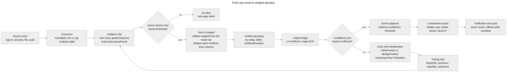
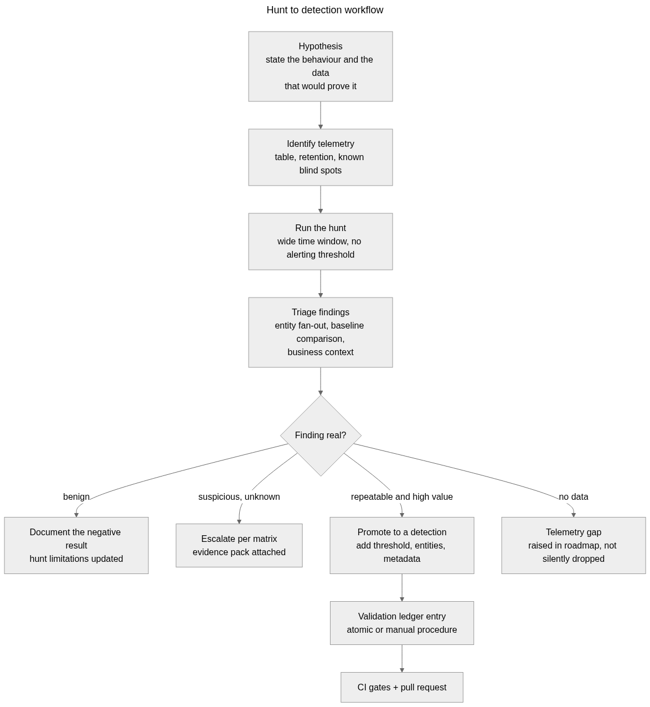
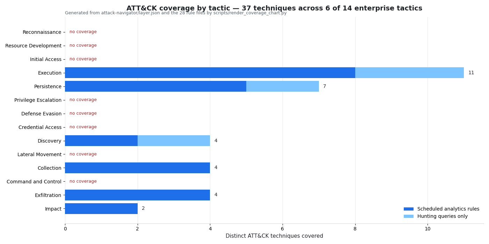
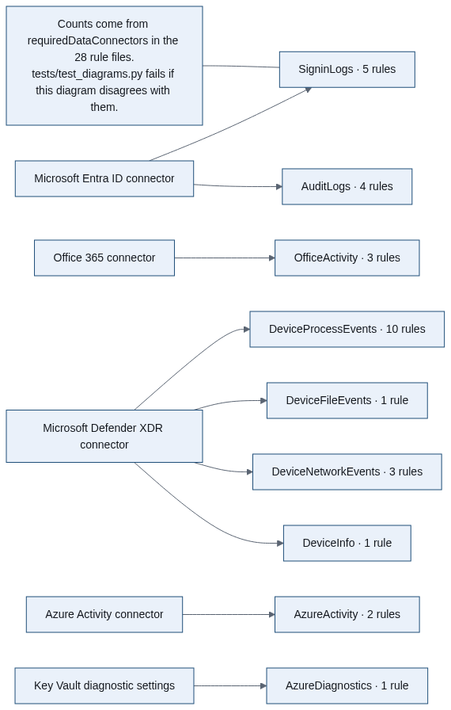
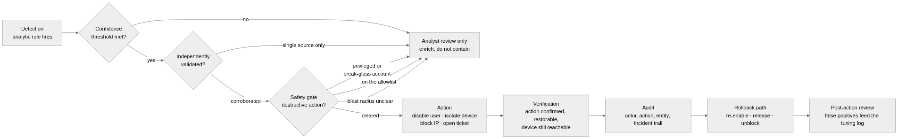
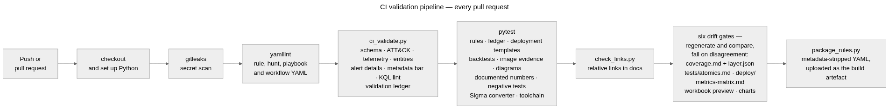
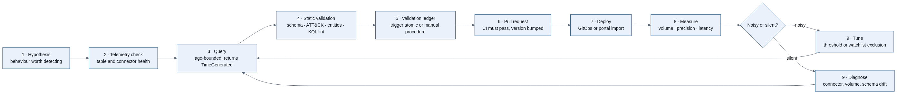
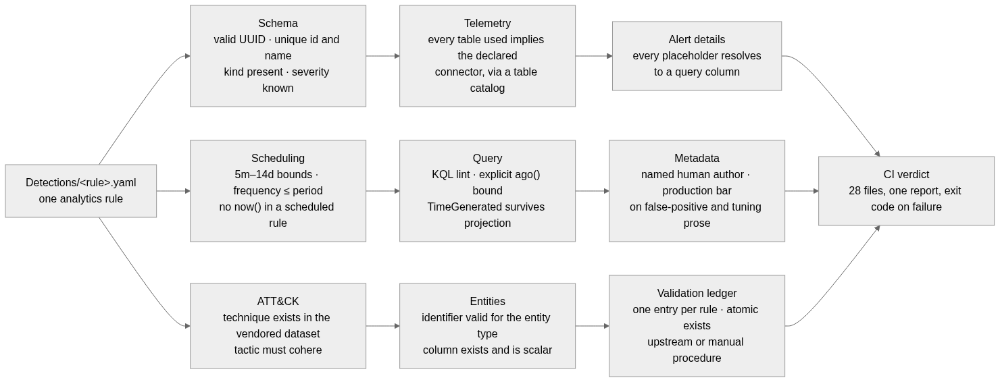

# sentinel-detection-engine

**Detection-as-code for Microsoft Sentinel and Microsoft Defender XDR** — 18 scheduled analytics
rules, 10 hypothesis-driven hunting queries, 4 SOAR playbooks behind explicit safety gates, an L3
triage workbook, generated ATT&CK coverage, a validation ledger that cites real Atomic Red Team
tests, and the full L3 SOC workflow documentation to go with them.

[](https://github.com/sandeepmothukuri/sentinel-detection-engine/actions/workflows/validate.yml)
[](https://github.com/sandeepmothukuri/sentinel-detection-engine/actions/workflows/release.yml)
[](LICENSE)

> **Validation status — read this first.** Nothing in this repository has been executed against a
> live tenant. Every rule is at `STATIC VALIDATION`: it passes schema, KQL lint, ATT&CK coherence,
> telemetry-to-connector parity and metadata checks in CI, and that is all. No incident numbers, no
> detection rates, no MTTA/MTTR figures and no screenshots of a live workspace appear anywhere in
> this repository, because none exist. Where a measurement would go, the repository says
> `Not yet measured`. See [§11 Validation methodology](#11-validation-methodology) and
> [`tests/atomics.md`](tests/atomics.md).

**Contents** · [1 Overview](#1-overview) · [2 Why](#2-why-this-exists) · [3 Architecture](#3-architecture) ·
[4 Detections](#4-detection-inventory) · [5 Hunting](#5-hunting-inventory) · [6 ATT&CK](#6-attck-coverage) ·
[7 Telemetry](#7-telemetry) · [8 SOAR](#8-soar) · [9 CI/CD](#9-cicd) · [10 Testing](#10-testing) ·
[11 Validation](#11-validation-methodology) · [12 Deployment](#12-deployment) ·
[13 Images](#13-screenshots-and-diagrams) · [14 Metrics](#14-metrics) · [15 Limitations](#15-limitations) ·
[16 Roadmap](#16-roadmap) · [17 Author](#17-author) · [18 License](#18-license)

**Jump to** · [Quick start](#12-deployment) · [Repository layout](#repository-layout) ·
[Documentation index](#documentation-index) · [How to verify this repository yourself](#how-to-verify-this-repository-yourself)

---

## 1. Overview

| | |
|---|---|
| **Scope** | Microsoft Sentinel detection engineering: Entra ID, Microsoft 365, Defender for Endpoint, Azure control plane and Key Vault |
| **Detections** | 18 scheduled analytics rules |
| **Hunting queries** | 10, each with a stated hypothesis, required telemetry, expected findings and limitations |
| **Response automation** | 4 playbooks, all behind a confidence threshold, an allowlist and a rollback path |
| **Reporting** | L3 triage workbook (13 panels), generated ATT&CK coverage, static HTML dashboard preview |
| **ATT&CK coverage** | 37 unique techniques across 12 of the 14 enterprise tactics |
| **Validation** | 28 ledger entries; 31 cited atomic test references verified to exist upstream; 14 rules with a written manual procedure where no atomic can exercise them |
| **Quality gates** | 18 checks in 9 families in `scripts/ci_validate.py`, 201 tests, 6 CI drift gates, secret scanning, SHA-pinned actions |
| **Author** | Sandeep Mothukuri |

## Repository layout

```
sentinel-detection-engine/
├── Detections/             18 scheduled analytics rules — the detection content
├── Hunting Queries/        10 hypothesis-driven KQL hunts
├── Playbooks/              4 Logic App playbooks, exported as ARM
├── Workbooks/              L3 triage dashboard definition (13 panels)
├── deploy/                 28 ARM templates generated from the rule files
├── attack-navigator/       ATT&CK Navigator layer, generated
├── coverage.md             generated coverage report
├── tests/                  201 tests, plus the validation ledger and the evidence templates
├── scripts/                18 tools: validator, generators, renderers, intake
├── docs/                   26 documents: architecture through to the IR runbook
└── .github/workflows/      validate, release and pull-request automation
```

## Documentation index

| Document | What it answers |
|---|---|
| [`docs/architecture.md`](docs/architecture.md) | How telemetry becomes a detection, and what the component boundaries are |
| [`docs/deployment.md`](docs/deployment.md) | Which portal, which deployment path, and what each one requires |
| [`docs/detection-development.md`](docs/detection-development.md) | The lifecycle a rule follows from hypothesis to measurement |
| [`docs/testing.md`](docs/testing.md) | What CI proves, what it cannot, and every test module |
| [`tests/validation/live-validation-guide.md`](tests/validation/live-validation-guide.md) | The procedure that would move a rule off `STATIC VALIDATION`, in order, with the safety constraints |
| [`docs/metrics.md`](docs/metrics.md) · [`docs/metrics-matrix.md`](docs/metrics-matrix.md) | The measurement framework, and its per-rule status |
| [`docs/tuning.md`](docs/tuning.md) | What happens after an alert, including how a rule is retired |
| [`docs/triage.md`](docs/triage.md) · [`docs/SOAR.md`](docs/SOAR.md) | Analyst workflow, and the automation safety gates |
| [`docs/ATTACK.md`](docs/ATTACK.md) · [`coverage.md`](coverage.md) | The mapping discipline, and the generated coverage |
| [`docs/data-sources.md`](docs/data-sources.md) | Connectors, tables, and the rules that depend on them |
| [`docs/troubleshooting.md`](docs/troubleshooting.md) | Every CI failure and connector symptom, with the fix |
| [`docs/evidence.md`](docs/evidence.md) | Provenance for every image, including what is deliberately absent |
| [`docs/production-readiness.md`](docs/production-readiness.md) · [`docs/limitations.md`](docs/limitations.md) | Honest scores against readiness dimensions, and the nine structural limits |
| [`docs/workflows/`](docs/workflows/) | IR runbook, triage SOP, escalation matrix, SOAR decision flow, tuning log, maturity assessment |
| [`tests/atomics.md`](tests/atomics.md) · [`tests/validation/validation-schema.yaml`](tests/validation/validation-schema.yaml) | The validation ledger as rendered, and the schema every entry must satisfy |

## How to verify this repository yourself

```bash
pip install -r requirements.txt          # the toolchain CI uses, declared once
python -m pytest tests -q                # 201 tests, offline, under ten seconds
python scripts/ci_validate.py            # 18 checks over every rule and hunt
python scripts/generate_coverage.py && git diff --exit-code   # generated artefacts are reproducible
python scripts/render_project_charts.py --check               # every chart still matches its numbers
```

Every number in this README is derived from the repository by
[`tests/test_documented_numbers.py`](tests/test_documented_numbers.py); if a count here stops
matching the files, the build fails rather than the reader finding out.

## 2. Why this exists

Most detection repositories are a folder of queries: they look plausible, they never say whether
they work, and nothing stops them from drifting away from the techniques they claim to cover.
This one is built around three ideas.

**A rule that has not been tested is a hypothesis, not a detection.** Every rule carries a
`validationStatus`, and the ledger records how it *would* be exercised — a specific upstream
atomic test where one exists, and a written manual procedure where one does not, with an
explanation of why. The ledger is machine-checked: a cited atomic that does not exist upstream
fails the build.

**Coverage claims should be generated, never typed.** `coverage.md` and
`attack-navigator/layer.json` are produced from rule metadata by a script, and CI fails on any
diff. A hand-written coverage number is a claim; a generated one is a fact about the repository.

**Nothing destructive happens because a query returned rows.** Account disable, device isolation
and IP blocking sit behind a confidence threshold, independent corroboration, a safety gate that
checks for privileged accounts and allowlists, and a documented rollback — see
[`docs/SOAR.md`](docs/SOAR.md).

## 3. Architecture



*Diagram source: `docs/diagrams/architecture/01-logical-architecture.mmd`. Image provenance for
every picture in the repository is recorded in [`docs/evidence.md`](docs/evidence.md).*

Telemetry flows from four source families through five connectors into nine Log Analytics tables;
18 rules and 10 hunts read those tables; alerts become entity-mapped incidents; incidents reach
analysts through the workbook and the triage SOP, and reach automation only through the SOAR
safety gate. Everything above the workspace — rules, hunts, playbooks, workbooks, scripts, docs —
is source-controlled and gated by CI.



## 4. Detection inventory

| Rule | Name | Severity | Tactics | Techniques | Schedule |
|---|---|---|---|---|---|
| `EntraID_ImpossibleTravel` | Entra ID - Impossible Travel Between Sign-Ins | High | InitialAccess, CredentialAccess | T1078.004, T1539 | 1h / 6h |
| `EntraID_MFAFatigue` | Entra ID - MFA Fatigue Followed by Success | High | CredentialAccess, InitialAccess | T1621, T1110.003 | 30m / 1h |
| `EntraID_LegacyAuthSuccess` | Entra ID - Successful Legacy Auth Sign-In | High | InitialAccess, DefenseEvasion, CredentialAccess | T1110, T1078.004 | 1h / 1h |
| `EntraID_ServicePrincipalCredAdd` | Entra ID - Service Principal Credential Added | High | Persistence, PrivilegeEscalation | T1098.001 | 1h / 1h |
| `EntraID_PrivilegedRoleAssignment` | Entra ID - Privileged Role Granted to User or Service Principal | Medium | Persistence, PrivilegeEscalation | T1098.003 | 1h / 1h |
| `M365_InboxRuleExfil` | M365 - Suspicious Inbox Rule (Forward / Delete) | High | Collection, Exfiltration, DefenseEvasion | T1114.003, T1564.008 | 1h / 1h |
| `M365_OAuthConsentSuspiciousApp` | M365 - OAuth Consent to High-Risk Scopes | High | InitialAccess, Persistence, CredentialAccess | T1528, T1098.001 | 1h / 1h |
| `M365_MassSharePointDownload` | M365 - Mass SharePoint / OneDrive Download | Medium | Collection, Exfiltration | T1213.002, T1567.002 | 1h / 14d |
| `MDE_PowerShell_EncodedCommand` | MDE - PowerShell EncodedCommand With Long Payload | High | Execution, DefenseEvasion | T1059.001, T1027 | 1h / 1h |
| `MDE_MSHTA_RemoteScript` | MDE - mshta Executing Remote Script | High | DefenseEvasion, Execution | T1218.005 | 1h / 1h |
| `MDE_LOLBin_Rundll32_Network` | MDE - rundll32 With External Network Connection | High | DefenseEvasion, Execution, CommandAndControl | T1218.011, T1071.001 | 1h / 1h |
| `MDE_PsExec_ServiceExecution` | MDE - PsExec-Style Service Execution | Medium | LateralMovement, Execution | T1569.002, T1021.002 | 1h / 1h |
| `MDE_WinRM_RemoteExecution` | MDE - WinRM Remote Command Execution | Medium | LateralMovement, Execution | T1021.006 | 1h / 1h |
| `MDE_ShadowCopyDeletion` | MDE - Shadow Copy / Recovery Inhibited | High | Impact | T1490 | 1h / 1h |
| `MDE_Ransomware_MassFileRename` | MDE - Ransomware-Style Mass File Rename Per Device | High | Impact | T1486 | 1h / 1h |
| `Azure_NSG_OpenToInternet` | Azure - NSG Rule Opens Port to 0.0.0.0/0 | High | InitialAccess, DefenseEvasion | T1190, T1686.001 | 1h / 1h |
| `Azure_KeyVault_SecretAccessSpike` | Azure - Key Vault Secret Access Spike Per Identity | High | CredentialAccess, Discovery | T1555.005, T1087.004 | 1h / 14d |
| `Azure_KeyVault_AccessControlChange` | Azure - Key Vault Access Policy or Network ACL Modified | High | Persistence, PrivilegeEscalation, DefenseEvasion | T1098, T1686.001 | 1h / 1h |

Every rule carries `metadata.falsePositives`, `metadata.tuningGuidance`, `metadata.suppression`,
`metadata.expectedVolume`, an entity mapping and an `alertDetailsOverride` so that alerts render a
readable name instead of repeating the rule title. Thresholds are named `let` bindings at the top
of each query; nothing is buried in a `where` clause.

Adding a rule means updating the ledger in the same pull request. CI fails otherwise.

## 5. Hunting inventory

| Query | Name | Techniques |
|---|---|---|
| `HUN_AnomalousMailboxForwarding` | HUN - Mailbox Forwarding to External Domain | T1114.003 |
| `HUN_FirstSeenASN_PerUser` | HUN - First-Seen ASN per User (30-day baseline) | T1078.004 |
| `HUN_SignInFromDatacenterASN` | HUN - Sign-In From Hosting / Datacenter ASN | T1078.004, T1090.003 |
| `HUN_GuestUserInvitedToPrivilegedGroup` | HUN - Guest User Added To Privileged Role / Group | T1098.003, T1136.003 |
| `HUN_NewScheduledTask` | HUN - New Scheduled Task With Script Action | T1053.005 |
| `HUN_OfficeChildProcess` | HUN - Office Apps Spawning Script Interpreters | T1566.001, T1059 |
| `HUN_RareProcessPerDevice` | HUN - Rare Process Per Device (org-wide rarity) | T1059, T1027 |
| `HUN_UnsignedBinaryFromTemp` | HUN - Unsigned Binary Execution From Temp/AppData | T1204.002, T1027 |
| `HUN_DNSRequestsToFreeDynamicDomains` | HUN - DNS Queries to Free / Dynamic / Tunneling TLDs | T1071.004, T1568.002 |
| `HUN_NewSSHConnectionFromInternal` | HUN - Lateral SSH/RDP From Workstation | T1021.001, T1021.004 |

Hunts carry `hypothesis`, `requiredTelemetry`, `expectedFindings`, `investigationSteps`,
`escalation` and `limitations`. A hunt that finds nothing is still a result: the workflow in
[the hunt workflow diagram](docs/diagrams/hunting/01-hunt-to-detection-workflow.mmd) sends negative
results to the telemetry-gap register rather than deleting them.



## 6. ATT&CK coverage



- **37 unique techniques**, **12 of 14 enterprise tactics** — see [`coverage.md`](coverage.md)
- Generated from rule metadata; CI fails if `coverage.md` or `attack-navigator/layer.json` is stale
- Techniques validated against a vendored MITRE CTI dataset (697 active techniques; retired ids
  rejected), currently the **v19** matrix in which Defense Evasion was replaced by Stealth (TA0005)
  and Defense Impairment (TA0112)
- Load [`attack-navigator/layer.json`](attack-navigator/layer.json) in the
  [ATT&CK Navigator](https://mitre-attack.github.io/attack-navigator/)

Reconnaissance and Resource Development have no coverage, and that is stated rather than hidden:
both describe activity on infrastructure the defender does not own. Full reasoning in
[`docs/ATTACK.md`](docs/ATTACK.md).

## 7. Telemetry



| Connector | Tables | Rules |
|---|---|---|
| Microsoft Entra ID | `SigninLogs`, `AuditLogs` | 5, 4 |
| Office 365 | `OfficeActivity` | 3 |
| Microsoft Defender XDR | `DeviceProcessEvents`, `DeviceFileEvents`, `DeviceNetworkEvents`, `DeviceInfo` | 10, 1, 3, 1 |
| Azure Activity | `AzureActivity` | 2 |
| Key Vault diagnostic settings | `AzureDiagnostics` | 1 |

Every table a query reads must be declared in `requiredDataConnectors` — checked against a
curated table catalog in CI, so a rule cannot silently depend on telemetry the deployment does not
provision. Table-level detail, retention and prerequisites: [`docs/data-sources.md`](docs/data-sources.md).

## 8. SOAR



Four playbooks: `AutoEnrichDisableUser`, `IsolateDeviceMDE`, `BlockIPAzureFirewall`,
`CreateServiceNowTicket`. The destructive three share one rule: **a query result alone never
triggers a destructive action.** Each takes a confidence threshold parameter (default 80), a
minimum severity, and an allowlist, and each documents its verification step and rollback path.
The flow is Detection → Confidence → Independent validation → Safety gate → Action → Verification →
Audit → Rollback. Details and parameter semantics: [`docs/SOAR.md`](docs/SOAR.md).

## 9. CI/CD



Every push and pull request runs:

| Gate | What it rejects |
|---|---|
| `gitleaks` | Any committed secret. Never disabled, never `continue-on-error`. |
| `yamllint` | Malformed rule, hunt and workflow YAML |
| `scripts/ci_validate.py` | 18 checks in 9 families: **schema** (required fields, UUID and name uniqueness, severity and status vocabulary, `kind`) · **scheduling** (`queryFrequency` and `queryPeriod` bounds, frequency ≤ period) · **ATT&CK** (technique ids exist in the vendored MITRE matrix, tactics cohere) · **telemetry** (every table the query reads is produced by a declared connector) · **entity mapping** (identifiers are real and the columns exist) · **alert details** (placeholders reference columns the query returns) · **metadata** (the production bar: `validationStatus`, `falsePositives`, `tuningGuidance`, `suppression`) · **KQL** (lint, explicit `ago()` bound, `TimeGenerated` retained by the final projection) · **validation ledger** (one entry per rule and vice versa, closed status vocabulary, citations that resolve upstream, a trigger atomic or a manual procedure) |
| `pytest` | 196 tests in twelve modules: 28 rule tests, 33 negative tests that prove the validator rejects bad input, 33 playbook safety-gate tests that hold the Logic Apps JSON to the behaviour `docs/SOAR.md` promises, 23 ledger tests, 16 tests of the generated deployment templates, 20 tests of image evidence hygiene, including the capture manifest that tracks which screenshots are still missing, 11 tests of everything drawn or registered (diagram counts, the chart gates, the workbook wireframe, the register), 9 backtesting-contract tests, 7 tests of the workflow files GitHub will accept, 7 Sigma converter tests, 11 tests that fail if a documented number drifts, including the validator's own check total, and 3 tests that keep the CI toolchain and `requirements.txt` from diverging |
| `actionlint` | The workflow files themselves: expressions, action inputs, shell. Installed from `requirements.txt` and run as its own CI step, because a workflow GitHub refuses to start fails every job with zero jobs and no output |
| `scripts/check_links.py` | Broken relative links in documentation |
| Drift ×6 | `coverage.md` + `attack-navigator/layer.json`, `tests/atomics.md`, `deploy/`, `docs/metrics-matrix.md`, the workbook preview digest and the generated charts must match what the generators produce. The chart gate compares the numbers it would draw, then the digests — re-rasterising a chart is not a repository change |
| `scripts/generate_arm_templates.py` | Regenerates `deploy/` — the ARM templates a Sentinel Repositories connection actually consumes — from the rule files |
| `scripts/generate_metrics_matrix.py` | Regenerates `docs/metrics-matrix.md` from the rule files and the validation ledger |
| `scripts/package_rules.py` | Produces the metadata-stripped YAML artefact for manual import |

Security posture: `permissions: contents: read` at workflow level, write scope only on the job
that publishes a release or posts a PR comment; all actions pinned to commit SHAs with a weekly
Dependabot job keeping the pins current; `pull_request_target` is not used; pull-request code runs
in a read-only job and its report is handed to a separate comment job through an artefact; shell
steps receive `github` values through the environment rather than inline interpolation.
Release: [`release.yml`](.github/workflows/release.yml) re-runs the entire validation workflow as
its gate before publishing a signed-checksum archive.

## 10. Testing

201 tests, no network access required, under ten seconds.

| Suite | What it covers |
|---|---|
| `tests/test_rules.py` | Loads every rule and hunt; asserts CI validation passes, counts, uniqueness, entity-mapping validity, schedule limits, connector parity, alert-detail placeholders, metadata quality, honest validation status, and regression tests for three shipped defects (inbox-rule parameter casing, `isnotempty` on a numeric cast, array columns in entity mappings) |
| `tests/test_validation.py` | The ledger: one entry per rule, closed status vocabulary, cited atomics exist upstream, partial mappings explain their gap, no validation claim without a dated evidence file, generator output current, plus nine negative tests that feed a broken ledger in and assert the specific failure |
| `tests/test_validator_negative.py` | 33 negative tests for the validator itself — a rule with a 30-day period, an undeclared connector, a mismatched technique, a dropped `TimeGenerated`, invalid KQL, placeholder text and AI-style author attribution must each fail with the right message |
| `tests/test_arm_templates.py` | The deployable artefact: every rule and hunt has a template, no property outside the alert-rule schema is emitted, the `metadata:` authoring block never leaks into a template, the resource name derives from the committed rule id so a re-sync updates rather than duplicates, and the converter refuses what it does not understand |
| `tests/test_backtest.py` | The backtesting contract: plan-only runs execute nothing and write nothing, a run without a workspace fails instead of producing a placeholder, and every query rewrite is reported |
| `tests/test_evidence.py` | Evidence hygiene: image metadata stripped, screenshot entries complete, lab captures named to convention, and no register entry left as a placeholder |
| `tests/test_diagrams.py` | The content of the pictures: numbers printed inside diagram sources, the architecture table-to-connector mapping, parity between the workbook and its HTML wireframe, and an evidence-register entry for every committed image |
| `tests/test_documented_numbers.py` | Fails the build when a count quoted in the README, `docs/testing.md`, `docs/architecture.md`, the README telemetry table or `docs/deployment.md` stops matching the repository |

A validator that has never rejected anything is untested, which is why the negative suite exists
and why one of its tests asserts that a rule claiming an invalid status fails with an actionable
error message.

## 11. Validation methodology



Four statuses, defined in [`tests/validation/validation-schema.yaml`](tests/validation/validation-schema.yaml):

| Status | Meaning | Enforced requirement |
|---|---|---|
| `STATIC VALIDATION` | Passes CI; nothing executed | — |
| `SIMULATED` | Exercised against deliberately produced telemetry outside production | Dated evidence file |
| `VALIDATED IN LIVE TENANT` | Fired on real telemetry in an authorised tenant, incident reviewed by a human | Dated evidence file **and** an incident reference |
| `NOT YET VALIDATED` | In the repository but not yet statically validated | A stated reason |

**Current state: 28 of 28 entries at `STATIC VALIDATION`.** 14 rules cite atomic tests that were
verified to exist upstream (31 references: 24 `trigger`, 3 `precondition`, 4 `partial`), and 14
have a written manual procedure because no atomic produces the telemetry they need. Mappings that
were considered and *refused* are recorded with their reasoning in the schema file — for example
T1528's atomics steal Azure Functions tokens and do not produce an OAuth consent grant, so citing
them would claim a validation that cannot happen.

Procedure for changing a status: [`tests/validation/live-validation-guide.md`](tests/validation/live-validation-guide.md).
Record format: [`tests/validation/evidence-template.md`](tests/validation/evidence-template.md).
Current view: [`tests/atomics.md`](tests/atomics.md).

**Backtesting interface.** `scripts/backtest_rule.py` answers *"what would this rule have produced
if it had been deployed 30 days ago?"* against a workspace you can query through the Azure CLI. It
plans before it runs, refuses to execute without a workspace, reports every `ago()` bound it widens,
and writes a report that labels itself a backtest observation rather than a validation. No backtest
output exists in this repository, because there is no workspace to query — see
[`tests/validation/backtests/README.md`](tests/validation/backtests/README.md).

## 12. Deployment

| Step | Where |
|---|---|
| Prerequisites, free-tier lab setup | [`docs/free-tier-setup.md`](docs/free-tier-setup.md) |
| Connectors and permissions | [`docs/deployment.md`](docs/deployment.md) |
| Import rules (GitOps, portal import, CLI) | [`docs/deployment.md`](docs/deployment.md), generated templates in [`deploy/`](deploy/README.md) |
| Deploy playbooks | [`docs/SOAR.md`](docs/SOAR.md) |
| Deploy the workbook | [`docs/deployment.md`](docs/deployment.md) |
| 30-minute guided walkthrough | [`docs/30-minute-walkthrough.md`](docs/30-minute-walkthrough.md) |

Content is portal-agnostic. Note the platform direction: **after 31 March 2027 Microsoft Sentinel
will be supported only in the Microsoft Defender portal**, so deployment and triage guidance
targets the Defender portal with Azure-portal paths kept as compatibility notes.

Read [`docs/production-readiness.md`](docs/production-readiness.md) before deploying anything into
an environment that matters. It lists what must be configured by you, what has never been
executed, and the gates that have to pass first.

## 13. Screenshots and diagrams

The repository contains 22 images: **20 generated from source in this repository, 1 design
preview carrying illustrative sample values, and 1 real screenshot** — the ATT&CK Navigator
rendering the committed layer. That is 14 Mermaid diagrams, 5 charts drawn from committed
repository data, 1 data-free workbook wireframe and 1 labelled sample-data workbook preview.
**No image shows a live Microsoft Sentinel tenant.** The only image containing invented incident
numbers or entities is `workbooks/02`, which says so in its own pixels and is enumerated line by
line in [`docs/evidence.md`](docs/evidence.md); every other image contains no measurement at all.

Captures of a live workspace cannot be produced by a repository, and an invented one would be a
fabrication. So the images that would prove the most — a deployed rule list, an incident the pack
raised, the workbook rendering real telemetry — are the images this repository deliberately does not
have. When you produce them, they are filed through
[`scripts/register_screenshot.py`](scripts/register_screenshot.py), which strips file metadata,
names and files the capture, and writes the register entry; `tests/test_evidence.py` then fails the
build if the entry lacks an environment, a date, a redaction statement or a completed description.

| Image | Kind |
|---|---|
| Architecture (logical, telemetry flow, deployment paths), connector coverage, evidence model, rule lifecycle, rule anatomy, tuning loop, hunt workflow, SOAR safety gate, IR lifecycle, CI pipelines, the v19 domain change | 14 diagrams generated from Mermaid source in `docs/diagrams/`. The `.mmd` file is the source of truth; the PNG is an export |
| ATT&CK coverage chart, coverage depth, detection inventory, validation status, GitHub social preview card | 5 charts drawn at build time by `scripts/render_project_charts.py` and `scripts/render_coverage_chart.py` from `attack-navigator/layer.json`, the rule files, the hunting queries and `tests/validation/atomics.yaml`. Every number on every chart is recomputed and compared in CI; no chart carries a hand-typed value |
| L3 workbook wireframe, data-free | Drawing generated from the workbook definition, carrying the banner *"Design preview — requires deployment to display live telemetry"* and showing `—` where values would appear. This is the one to show when the layout is the point |
| L3 workbook sample-data illustration | The same 13 panels with **illustrative** sample values, so the layout can be seen at realistic scale. The incidents, counts, MTTA and MTTR on it are invented samples; the image says so across its top and its foot, and `docs/evidence.md` lists every value. It is layout intent, never evidence of a detection |
| ATT&CK Navigator export | Screenshot of the committed layer rendered in Navigator on the author's workstation |

Every image's purpose, source, environment, date, what it demonstrates and what was redacted is
recorded in [`docs/evidence.md`](docs/evidence.md). There is intentionally no screenshot of an
analytics-rule blade, an incident queue, or the workbook rendering **real** telemetry: producing
one honestly would require a live workspace, and there is not one.



## 14. Metrics

Every number here is `Not yet measured`. That is the honest state: metrics require a deployed rule
and closed incidents.

| Metric | Value | Source once deployed |
|---|---|---|
| Events evaluated per rule | `Not yet measured` | query result counts |
| Alerts per rule | `Not yet measured` | `SecurityAlert` |
| True / false / benign positive counts | `Not yet measured` | `SecurityIncident.Classification` |
| Precision, false-positive rate | `Not yet measured` | ratio of classified closures |
| Alert volume per day | `Not yet measured` | `SecurityAlert` by day |
| Detection latency (event → alert) | `Not yet measured` | `TimeGenerated` vs `StartTime` |
| MTTA / MTTR | `Not yet measured` | `FirstModifiedTime`, `ClosedTime` |
| Suppression rate | `Not yet measured` | suppression metadata plus closures |
| Closure reason | `Not yet measured` | `ClassificationReason` |

The per-rule measurement table, the queries that fill it, the closure-discipline rules and the
tuning gate (>30% false positives on ≥5 closures) are in
[`tests/validation/performance-metrics.md`](tests/validation/performance-metrics.md);
[`docs/metrics.md`](docs/metrics.md) explains why each metric matters and how it is abused.
The workbook's tuning-candidates panel implements the same gate, so a rule cannot be nominated for
tuning on the strength of one bad day.

## 15. Limitations

- **Nothing has been executed.** No rule, hunt or playbook in this repository has produced an
  alert, an incident or an automation run outside CI. The single largest limitation, stated first.
- **Thresholds are estimates.** Every threshold is defensible and explained, but it was chosen from
  the behaviour it describes, not from an observed baseline. Expect to tune.
- **Single author.** No second reviewer has seen this content. CI gates are the compensating
  control; they are real, and they run on every commit.
- **Baseline-dependent rules behave differently on day one.** Impossible travel, mass download and
  Key Vault spike rules need history before they are meaningful.
- **Threat intelligence is modelled, not implemented.** No MISP or TAXII connector is configured;
  the integration is described as a future design in [`docs/data-sources.md`](docs/data-sources.md).
- **Coverage is intent, not efficacy.** A covered technique means a rule exists, not that it fires
  in your telemetry.
- **Two tactics are uncovered** by design, and two behaviour families (T1685, host firewall) are
  only partly covered because they would need telemetry this repository does not assume.
- **Backtesting has an interface, not a result.** `scripts/backtest_rule.py` runs a rule's query over
  a historical window, but no window has been queried: there is no workspace here to query.
- **The automation layer is unexecuted.** Four playbooks depend on resources that exist only in a
  real tenant. Their ARM templates are parameterised with no defaulted secrets, and none has been
  deployed.

The limits that follow from these, with what mitigates each one and what would close it, are written
out in [`docs/limitations.md`](docs/limitations.md).

## 16. Roadmap

**Completed** — the rule pack with its metadata bar; hunting queries with full hunt metadata; four
playbooks with safety gates; 18-check CI validator; 201-test suite including negative tests;
generated ATT&CK coverage, validation ledger and ARM deployment templates, all drift-gated;
evidence register; Microsoft current-state alignment; SHA-pinned CI with least privilege.

**In progress** — coverage of the techniques left uncovered by the v19 Defense Evasion split;
migrating hand-rolled `stdev` anomaly logic to `series_decompose_anomalies` once there is a tenant
to calibrate against.

**Environment dependent** — every item that needs a tenant, and which no further code can
substitute for: executing the cited atomics and the manual procedures; closing incidents so
precision and false-positive rate become measurable; running the destructive atomics on a
disposable VM; triggering each playbook with a test incident and recording the rollback.

**Future enhancement** — threat-intelligence enrichment via MISP/TAXII once a real feed exists to
point at; multi-workspace workbooks; the Sentinel data lake and Defender advanced hunting
surfaces; additional telemetry families (identity protection risk events, Purview DLP) if and when
a deployment actually ingests them.

Roadmap items are not decoration: the second and fourth sections are the ones that would move the
scores in [`docs/production-readiness.md`](docs/production-readiness.md).

## 17. Author

**Sandeep Mothukuri** — detection engineering, Microsoft Sentinel, L3 SOC operations.

Every commit in this repository is authored by the same person. There are no AI or bot
contributors, no AI-generated content, no fabricated screenshots, no invented incident numbers and
no purchased or simulated engagement metrics. Components that would be dishonest to fake — live
detection rates, tenant validation, production incidents — are recorded as
`Not yet measured` or `Requires live tenant validation` throughout, and CI enforces the fields
that would otherwise be quietly filled in with something plausible.

## 18. License

MIT — see [`LICENSE`](LICENSE). Copyright (c) 2026 Sandeep Mothukuri.
