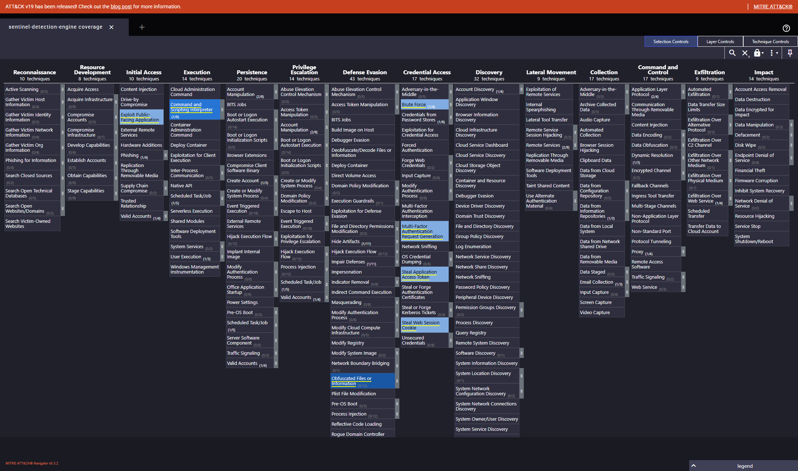

# sentinel-detection-engine

**Enterprise Microsoft Sentinel Detection-as-Code and SOC Engineering Lab** — a curated, CI-validated detection pack: 12 scheduled analytics rules, 10 hypothesis-driven hunting queries, 4 SOAR playbooks, an L3 triage workbook, auto-generated ATT&CK Navigator coverage, and an Atomic Red Team validation ledger.

**Author:** Sandeep Mothukuri — SOC L3 / Detection Engineering
**Repo:** [`sandeepmothukuri/sentinel-detection-engine`](https://github.com/sandeepmothukuri/sentinel-detection-engine)

[](https://github.com/sandeepmothukuri/sentinel-detection-engine/actions/workflows/validate.yml)


---

## What this is (and is not)

- **Is:** a detection-as-code repository with a strict validation pipeline — schema, KQL lint, real ATT&CK validation against MITRE CTI, telemetry/connector cross-checks, tuning metadata, and a pytest suite — plus the SOC workflow docs an L3 analyst expects.
- **Is not (yet):** a pack with live-tenant validation results. Every rule is at **STATIC VALIDATION**: CI proves structure and consistency, but no rule has been fired against a live Sentinel tenant by the author. The [validation ledger](tests/atomics.md) records this openly and defines exactly how to change it. No screenshots or statistics in this repo are fabricated.

## Architecture

```
rules + hunts (YAML) ──▶ CI validate ──▶ deploy (GitOps / manual / tarball) ──▶ Sentinel
        │                  │  schema · ATT&CK (MITRE CTI) · telemetry tables │
        │                  │  KQL lint · pytest · links · gitleaks            ▼
        │                                                            incidents
        └── docs ◀── tuning loop ◀── workbook KPIs ◀──────────────────────┤
                                            SOAR playbooks (gated) ◀──────┘
```

## Detection inventory (12)

| Family | Rules | Tables |
|---|---|---|
| Entra ID | [Impossible Travel](Detections/EntraID_ImpossibleTravel.yaml) · [MFA Fatigue](Detections/EntraID_MFAFatigue.yaml) · [Legacy Auth Success](Detections/EntraID_LegacyAuthSuccess.yaml) · [SP Credential Added](Detections/EntraID_ServicePrincipalCredAdd.yaml) | `SigninLogs`, `AuditLogs` |
| Microsoft 365 | [Inbox Rule Exfil](Detections/M365_InboxRuleExfil.yaml) · [Mass SharePoint Download](Detections/M365_MassSharePointDownload.yaml) · [OAuth Illicit Consent](Detections/M365_OAuthConsentSuspiciousApp.yaml) | `OfficeActivity`, `AuditLogs` |
| Endpoint (MDE) | [rundll32 + Network](Detections/MDE_LOLBin_Rundll32_Network.yaml) · [mshta Remote Script](Detections/MDE_MSHTA_RemoteScript.yaml) · [PowerShell EncodedCommand](Detections/MDE_PowerShell_EncodedCommand.yaml) | `DeviceProcessEvents`, `DeviceNetworkEvents` |
| Azure | [NSG Open to Internet](Detections/Azure_NSG_OpenToInternet.yaml) · [Key Vault Access Spike](Detections/Azure_KeyVault_SecretAccessSpike.yaml) | `AzureActivity`, `AzureDiagnostics` |

Every rule ships with: entity mappings, incident grouping configuration, false-positive analysis, tuning guidance with named thresholds, suppression policy, expected volume, and version — see [detection-development.md](docs/detection-development.md).

## Hunting (10)

Hypothesis-driven hunts with structured metadata (hypothesis, required telemetry, expected findings, investigation steps, escalation, limitations): [first-seen ASN per user](Hunting%20Queries/HUN_FirstSeenASN_PerUser.yaml), [datacenter-ASN sign-ins](Hunting%20Queries/HUN_SignInFromDatacenterASN.yaml), [mailbox forwarding](Hunting%20Queries/HUN_AnomalousMailboxForwarding.yaml), [guest → privileged role](Hunting%20Queries/HUN_GuestUserInvitedToPrivilegedGroup.yaml), [scheduled-task persistence](Hunting%20Queries/HUN_NewScheduledTask.yaml), [Office spawning interpreters](Hunting%20Queries/HUN_OfficeChildProcess.yaml), [rare processes estate-wide](Hunting%20Queries/HUN_RareProcessPerDevice.yaml), [unsigned binaries from %TEMP%](Hunting%20Queries/HUN_UnsignedBinaryFromTemp.yaml), [dynamic-DNS C2](Hunting%20Queries/HUN_DNSRequestsToFreeDynamicDomains.yaml), [workstation SSH/RDP fan-out](Hunting%20Queries/HUN_NewSSHConnectionFromInternal.yaml).

## ATT&CK coverage

The [Navigator layer](attack-navigator/layer.json) and [coverage.md](coverage.md) are **generated from rule metadata** — 31 unique techniques. Every technique id is validated against a dataset built from official MITRE CTI (revoked/deprecated excluded, v18 vocabulary normalised); a stale id fails CI. Details: [docs/ATTACK.md](docs/ATTACK.md).



## CI/CD

Three workflows: [validate](.github/workflows/validate.yml) (yamllint, gitleaks, rule validation, pytest, link check, coverage-drift check, GitOps packaging), [pr-detection-report](.github/workflows/pr-detection-report.yml) (sticky PR comment: added/modified/deleted rules, severity/tactic/technique/query diffs, version-bump warnings), and [release](.github/workflows/release.yml) (tagged tarball + SHA-256 + changelog).

## Atomic Red Team

Each detection maps to [Atomic Red Team](https://github.com/redcanaryco/atomic-red-team) tests or a documented manual procedure in the [validation ledger](tests/atomics.md). The ledger uses four statuses — `VALIDATED IN LIVE TENANT`, `SIMULATED`, `STATIC VALIDATION`, `NOT YET VALIDATED` — and currently every entry is `STATIC VALIDATION`. Nothing is claimed as fired that wasn't.

## SOAR

Four playbooks with a hard safety model — severity gates, confidence thresholds, exclusion/allow-lists, IP-count ceilings, single-flight concurrency, audit comments on every path including no-action, and embedded rollback: [AutoEnrichDisableUser](Playbooks/AutoEnrichDisableUser/README.md) · [IsolateDeviceMDE](Playbooks/IsolateDeviceMDE/README.md) · [BlockIPAzureFirewall](Playbooks/BlockIPAzureFirewall/README.md) · [CreateServiceNowTicket](Playbooks/CreateServiceNowTicket/README.md). Design rationale: [docs/SOAR.md](docs/SOAR.md).

## Workbook

[L3 Triage Dashboard](Workbooks/L3-Triage-Dashboard.json) — incident KPIs, severity donut, top firing rules, daily detection trend, tactic distribution, top entities, MTTA/MTTR, **tuning indicators** (rules with the highest benign-positive closure rate), and the open-incident queue.

## Deployment

Three paths, documented in [docs/deployment.md](docs/deployment.md): Sentinel Repositories (GitOps — CI publishes a schema-clean copy via `scripts/package_rules.py`), manual import, and release tarballs. Includes connector enablement, least-privilege roles per playbook identity, and secret handling. Free-tier quickstart: [docs/30-minute-walkthrough.md](docs/30-minute-walkthrough.md) · [docs/free-tier-setup.md](docs/free-tier-setup.md).

## Documentation

[Architecture](docs/architecture.md) · [Deployment](docs/deployment.md) · [Detection development](docs/detection-development.md) · [Testing](docs/testing.md) · [Tuning](docs/tuning.md) · [Triage](docs/triage.md) · [SOAR](docs/SOAR.md) · [ATT&CK](docs/ATTACK.md) · [Data sources](docs/data-sources.md) · [Troubleshooting](docs/troubleshooting.md) · [Metrics](docs/metrics.md) — plus the workflow pack: [IR runbook](docs/workflows/ir-runbook.md), [triage SOP](docs/workflows/triage-sop.md), [escalation matrix](docs/workflows/escalation-matrix.md), [SOAR decision flow](docs/workflows/soar-decision-flow.md), [tuning log](docs/workflows/tuning-log.md), [maturity assessment](docs/workflows/maturity-assessment.md).

## Validation status at a glance

| Check | Status |
|---|---|
| Schema / metadata validation (22 rules) | Passing |
| ATT&CK validation (MITRE CTI dataset) | Passing |
| KQL lint | Passing |
| pytest suite | 22/22 passing |
| Live-tenant validation | Not yet performed — see [testing.md](docs/testing.md) |

## Limitations

- No rule has produced a live incident in a verified tenant; KQL is linted, not executed by CI.
- `validationStatus` claims must match evidence; the ledger and YAML statuses are CI-checked for vocabulary, and honesty is enforced by review.
- The Sigma → KQL converter handles a documented subset (four categories, bounded conditions) and fails loudly outside it — it is not a pySigma replacement.
- ATT&CK dataset is refreshed manually (`scripts/build_attack_data.py`).

## Roadmap

Only items that remain open; completed work is reflected in the repo itself.

- [ ] Live-tenant validation: execute the atomic ledger and move rules to `VALIDATED IN LIVE TENANT` / `SIMULATED`
- [ ] Record measured precision/FP-rate per rule in [docs/metrics.md](docs/metrics.md) after 30 days of live data
- [ ] AWS GuardDuty / CloudTrail analog pack
- [ ] Defender for Cloud Apps (MCAS) coverage

## License

[MIT](LICENSE)
