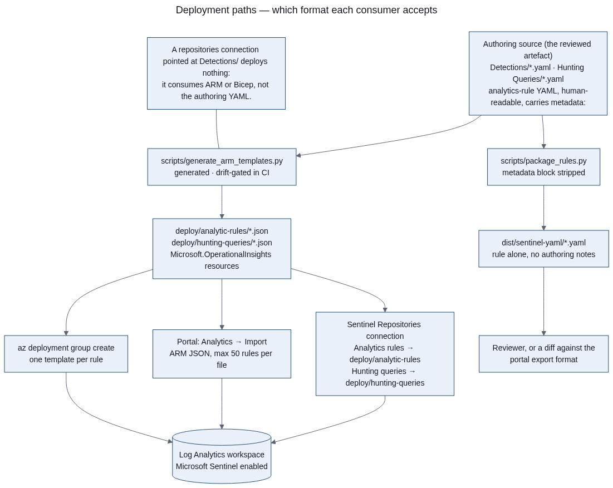

# Deployment



*Generated by `scripts/render_diagrams.py` from `docs/diagrams/architecture/03-deployment-paths.mmd`.
Three supported paths, one source of truth: the authoring YAML is what you edit and what CI checks,
and `deploy/` is the generated ARM that the paths below consume.*

## Which portal

Microsoft Sentinel is generally available in the **Microsoft Defender portal**, and after
**31 March 2027 Sentinel will no longer be supported in the Azure portal** — remaining Azure-portal
users are redirected. Deploy and operate through the Defender portal; the Azure-portal paths below
are kept as compatibility notes for tenants that have not onboarded yet.

Content in this repository is portal-agnostic: analytics-rule YAML, KQL, workbooks and Logic App
templates are identical either way. Three operational differences are worth knowing before you
deploy, because they change what an analyst sees rather than what the rules do:

| Difference | Consequence for this pack |
|---|---|
| Defender correlates alerts into incidents more aggressively across identity, endpoint, email and cloud | Expect fewer, richer incidents than a per-rule count suggests. The workbook counts incidents by `IncidentNumber` with `arg_max` rather than assuming one alert per incident, so its numbers stay correct. |
| `SecurityIncident.Description` is not included after onboarding | The workbook does not read `Description`; it reads `Title`, `Classification`, `Owner` and the timestamps. The triage SOP tells analysts to use the incident's alert entities instead. |
| Defender RBAC replaces Azure RBAC for Sentinel in the portal | Workbook and rule visibility may differ from the Azure-portal RBAC model. Grant the workbook viewer role through Defender RBAC, and review table-level RBAC if you rely on `IdentityInfo`. |

## The formats matter more than the paths

This repository stores detections in the **analytics-rule YAML authoring format** (the layout
[Azure/Azure-Sentinel](https://github.com/Azure/Azure-Sentinel) publishes). That is a good format to
review and version, and it is **not** the format Microsoft Sentinel's CI/CD connection consumes:

| Consumer | Format it accepts | Where it is |
|---|---|---|
| Sentinel Repositories (GitOps connection) | **ARM or Bicep templates** | [`deploy/`](../deploy/README.md) — generated by `scripts/generate_arm_templates.py` |
| Portal **Analytics → Import** | **ARM template JSON**, up to 50 rules per file | same generated templates |
| Portal manual authoring | form fields; paste the query | `Detections/*.yaml` `query:` block |
| Content Hub / solution packaging | authoring YAML | `Detections/*.yaml` |

Connecting a repository and pointing the "Analytic rules" content type at `Detections/` does **not**
sync those rules — they must be converted first. That is why `deploy/` exists, why it is generated
in CI, and why a drift gate fails the build if it stops matching the rules.

## Prerequisites

- An Azure subscription with a **Log Analytics workspace** (create via portal or `az monitor log-analytics workspace create`).
- **Microsoft Sentinel enabled** on the workspace (Sentinel → Add; requires Contributor on the resource group).
- Identity performing the deployment: `Microsoft.SecurityInsights` Contributor on the workspace resource group. Never use Global Admin for deployment.

## Data connectors required by this pack

| Connector (`connectorId`) | Feeds | Rules |
|---|---|---|
| `AzureActiveDirectory` (Entra ID) | `SigninLogs`, `AuditLogs` | 6 detections + 3 hunts |
| `Office365` | `OfficeActivity` | 2 detections + 1 hunt |
| `MicrosoftThreatProtection` (Defender XDR advanced hunting) | `DeviceProcessEvents`, `DeviceNetworkEvents`, `DeviceFileEvents`, `DeviceInfo` | 7 detections + 6 hunts |
| `AzureActivity` | `AzureActivity` | 2 detections |
| `AzureKeyVault` (diagnostic settings) | `AzureDiagnostics` | 1 detection |

Notes:
- For MDE devices: onboard endpoints to Defender for Endpoint first; the `MicrosoftThreatProtection` connector streams advanced hunting tables into Sentinel.
- For Key Vault: enable **diagnostic settings** on each vault (SecretGet/KeyGet/CertificateGet audit events and control-plane changes) or the Key Vault rules have nothing to read.
- Legacy auth detection only sees events if legacy/basic auth is not fully blocked yet — that is the point: it verifies the control.

## Path 1 — Sentinel Repositories (GitOps)

The connection syncs **ARM templates** from your fork of this repository. One-time setup:

1. Fork or mirror this repository to a repo you are a collaborator on. GitHub and Azure DevOps are
   the supported hosts; the workspace must be in the same tenant as an Azure DevOps connection.
2. Microsoft Defender portal → **Microsoft Sentinel → Content management → Repositories → Add new**,
   then authorise Sentinel against your fork (GitHub PAT or Azure DevOps project admin; the
   credential is stored by Sentinel, never in this repository).
3. In the connection, select the content types you want and set each folder:

   | Content type | Folder |
   |---|---|
   | Analytic rules | `deploy/analytic-rules` |
   | Hunting queries | `deploy/hunting-queries` |
   | Workbooks | wrap `Workbooks/L3-Triage-Dashboard.json` in an ARM template first ([how](https://learn.microsoft.com/azure/azure-monitor/visualize/workbooks-automate)) |
   | Playbooks | `Playbooks` (already ARM) |

4. Commit. Every later push to the connected branch re-deploys the selected content.

Operational facts worth knowing before you rely on this path:

- **The repository becomes the source of truth.** Sentinel overwrites portal edits to connected
  content on the next sync. Tune rules by changing the rule file, regenerating `deploy/`, and
  committing — not in the portal.
- **Limits**: five repository connections per workspace, and 800 deployments per resource group of
  deployment history (`DeploymentQuotaExceeded` is the symptom once that fills).
- **The `workspace` parameter** is the only parameter each generated template takes. The rule's
  resource name uses the `id` committed in the rule file, so a re-sync updates the existing rule
  instead of creating a duplicate.
- **Cross-workspace queries** are only supported when the destination workspace is in the same
  resource group as the connected workspace. No rule in this pack needs one.

## Path 2 — Portal import of the generated ARM templates

1. Analytics: **Analytics → Import**, select a file from `deploy/analytic-rules/`. Import is ARM
   JSON, up to 50 rules per file, and is a preview feature.
2. Hunts: there is no portal import for saved searches; use `az monitor log-analytics workspace
   saved-search create` with the JSON from `deploy/hunting-queries/`, or author them by hand.
3. Workbook: Workbooks → Advanced editor → paste `Workbooks/L3-Triage-Dashboard.json`.
4. Playbooks: deploy each ARM template (see `Playbooks/*/README.md`), authorise the API connections,
   then create an automation rule to bind them.

To import the authoring YAML instead, convert it with Microsoft's
[`ConvertSentinelRuleFrom-Yaml.ps1`](https://github.com/Azure/Azure-Sentinel/blob/master/Tools/ConvertYamlToJson/ConvertSentinelRuleFrom-Yaml.ps1)
— the same conversion `scripts/generate_arm_templates.py` performs, and this repository's tests
describe what its output should contain.

## Path 3 — Azure CLI / ARM deployment

```bash
# One rule, straight from the generated template
az deployment group create \
  --resource-group <rg> \
  --template-file deploy/analytic-rules/MDE_ShadowCopyDeletion.json \
  --parameters workspace=<workspace-name>

# A playbook
az deployment group create \
  --resource-group <rg> \
  --template-file Playbooks/AutoEnrichDisableUser/azuredeploy.json
```

Release tags (`v*.*.*`) produce a versioned tarball with SHA-256 checksums on the GitHub Releases
page. The tarball contains both the authoring YAML and the generated ARM templates.

## Permissions & least privilege

| Identity | Role | Scope |
|---|---|---|
| Deploying admin | Microsoft Security Insights Contributor | Workspace RG |
| Playbook (disable user) | Graph `User.EnableDisableUser` only + Sentinel Responder | Workspace |
| Playbook (isolate device) | MDE `Machine.Isolate` + `Machine.Read.All` | MDE API |
| Playbook (block IP) | Network Contributor on the IP Group only | IP Group resource |
| Playbook (ServiceNow) | ServiceNow connection account, ITIL role on incident table | ServiceNow |

## Secrets

- VirusTotal / AbuseIPDB API keys are stored **in the API connection** authorisation flow, never in code or ARM parameters.
- GitHub tokens, ServiceNow credentials, and PATs live in their respective secret stores.
- CI scans every push for committed secrets (gitleaks job in `validate.yml`).

## Post-deployment verification

1. Run [docs/30-minute-walkthrough.md](30-minute-walkthrough.md) or [docs/free-tier-setup.md](free-tier-setup.md).
2. Confirm rules appear and are enabled; check "Last run" status after `queryFrequency`.
3. Validate end-to-end with the procedures in [testing.md](testing.md) — nothing here has been
   deployed by the author, so your first deployment **is** the test. Record what you saw in the
   ledger per [`tests/validation/live-validation-guide.md`](../tests/validation/live-validation-guide.md).

## Troubleshooting

See [troubleshooting.md](troubleshooting.md).
