# Image gallery

Every image in the repository, in order. Each one is described in full — purpose, source, environment, date, redactions — in [`../evidence.md`](../evidence.md).

One image is a capture of a real environment (the ATT&CK Navigator export). The rest are diagrams and charts generated from this repository's own files, or the two labelled workbook previews. There is no AI-generated imagery and no mock-up of a system that does not exist.

Captures that are still missing are listed at the end rather than filled in with a drawing.

---

## Architecture

How the pieces fit: sources, workspace, rule pipeline, response automation.

### `architecture/01-logical-architecture.png`

*Diagram* — The intended architecture of the repository: four telemetry sources, the connectors that ingest them, the Log Analytics tables the rules query, the 18 scheduled analytics rules and 10 hunting queries, incident generation, the four response playbooks, and the engineering control plane (Git repository, CI, generated ATT&CK artefacts).

### `architecture/02-telemetry-to-detection-flow.png`

*Diagram* — How a single event becomes an analyst decision: source event → connector → table → analytics rule (with `queryFrequency` and `queryPeriod` in the loop) → threshold decision → entity-mapped alert → incident grouping → triage → SOAR behind a confidence gate → containment → verification and audit → tuning loop back into the rule.

### `architecture/03-deployment-paths.png`

*Diagram* — The three ways the rule pack reaches a workspace — a Sentinel Repositories connection consuming the generated ARM templates in `deploy/`, an import of the packaged YAML produced by `scripts/package_rules.py`, or a manual portal import — and where each path's prerequisites stop. It records the constraint that decided the design: a Sentinel repository deploys Bicep or ARM only, so raw `Detections/*.yaml` is not deployable on its own.

---

## Sentinel workspace

Connectors and tables, the evidence model, and where validation actually stands.

### `sentinel/01-connector-table-coverage.png`

*Diagram* — Which connector is needed for which table, and how many rules depend on each table: SigninLogs 5, AuditLogs 4, OfficeActivity 3, DeviceProcessEvents 10, DeviceNetworkEvents 3, DeviceFileEvents 1, DeviceInfo 1, AzureActivity 2, AzureDiagnostics 1.

### `sentinel/02-evidence-and-validation-model.png`

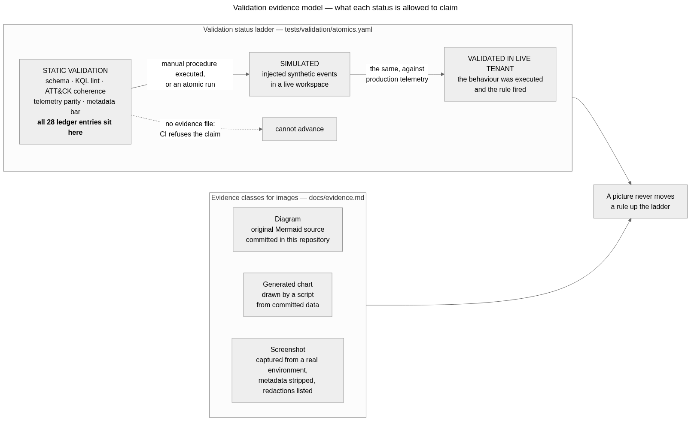

*Diagram* — What each level of evidence in this repository can and cannot support, from static validation through the atomic mapping in `tests/validation/atomics.yaml` to the measurements that only a live tenant can produce. It is the picture behind the `STATIC VALIDATION` label that every row of [`metrics-matrix.md`](../metrics-matrix.md) carries: which checks ran, which are waiting on an environment, and which claims the repository therefore declines to make.

### `sentinel/03-validation-status.png`

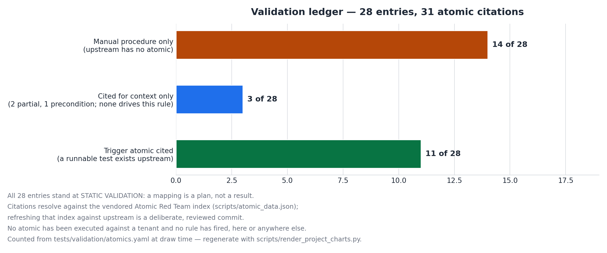

*Generated chart* — How the 28 ledger entries are validated today: 11 cite a trigger atomic that exists upstream, 3 cite atomics for context only (2 `partial`, 1 `precondition`), and 14 carry a manual procedure because upstream Atomic Red Team has no atomic for that behaviour. The caption states the honest reading — all 28 entries are at `STATIC VALIDATION`, and a mapping is a plan, not a result.

---

## Detections

The rule lifecycle, the anatomy of a rule, and the tuning loop.

### `detections/01-rule-development-lifecycle.png`

*Diagram* — The nine-step lifecycle this repository actually enforces: hypothesis, telemetry check, query, static validation, validation-ledger entry, pull request with CI gates, deployment, measurement, and the tune-or-diagnose branch that returns to the query.

### `detections/02-analytics-rule-anatomy.png`

*Diagram* — Which validation gate inspects which section of a rule file — schema and scheduling bounds, ATT&CK coherence, telemetry-to-connector parity, KQL lint and time bounds, entity validity, alert-detail placeholders, metadata quality, and the validation ledger.

### `detections/03-tuning-and-feedback-loop.png`

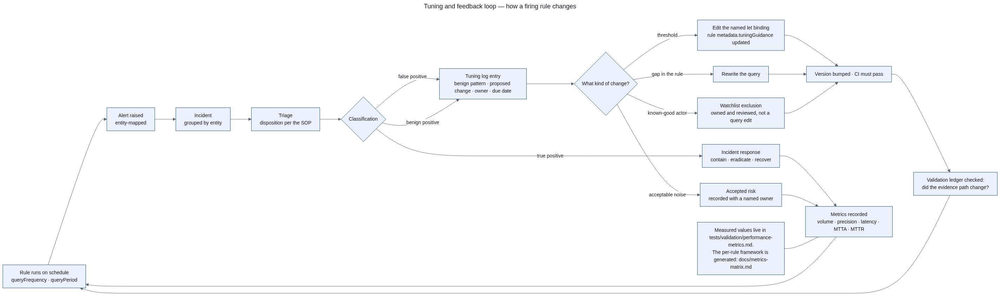

*Diagram* — What happens after an alert, which is where most detection repositories stop: how a false positive is classified, whether the fix is a threshold, an exclusion, an entity mapping or a rewrite, what has to be recorded for the change to be reviewable, and why a rule is retired rather than quietly left running.

### `detections/04-inventory-overview.png`

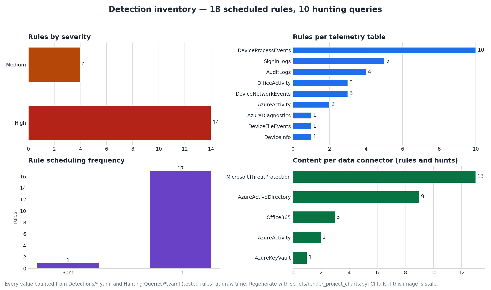

*Generated chart* — The shape of the inventory in one picture: 18 scheduled rules (14 High, 4 Medium) and 10 hunting queries; 9 Log Analytics tables (DeviceProcessEvents 10, SigninLogs 5, AuditLogs 4, OfficeActivity 3, DeviceNetworkEvents 3, AzureActivity 2, AzureDiagnostics 1, DeviceFileEvents 1, DeviceInfo 1); 17 rules on an hourly schedule and 1 on 30 minutes; and 5 connectors (MicrosoftThreatProtection 13, AzureActiveDirectory 9, Office365 3, AzureActivity 2, AzureKeyVault 1). Table and connector counts include the hunting queries, which is the same population [`data-sources.md`](../data-sources.md) summarises.

---

## Hunting

How a hunt becomes a detection.

### `hunting/01-hunt-to-detection-workflow.png`

*Diagram* — How a hunt hypothesis is run, triaged and either closed with a documented negative result, escalated, recorded as a telemetry gap, or promoted into a detection with its own validation-ledger entry and CI gates.

---

## SOAR

The safety gate that stands between an alert and a destructive action.

### `soar/01-soar-safety-gate-flow.png`

*Diagram* — The control that matters most in this repository: a destructive action (disable account, isolate device, block IP) is never taken because a query returned rows. The flow requires a confidence threshold, independent corroboration, and a safety gate that routes privileged or break-glass accounts, allowlisted entities and unclear blast radii back to analyst review. Every automated action still ends in verification, audit and a rollback path.

### `soar/02-ir-lifecycle.png`

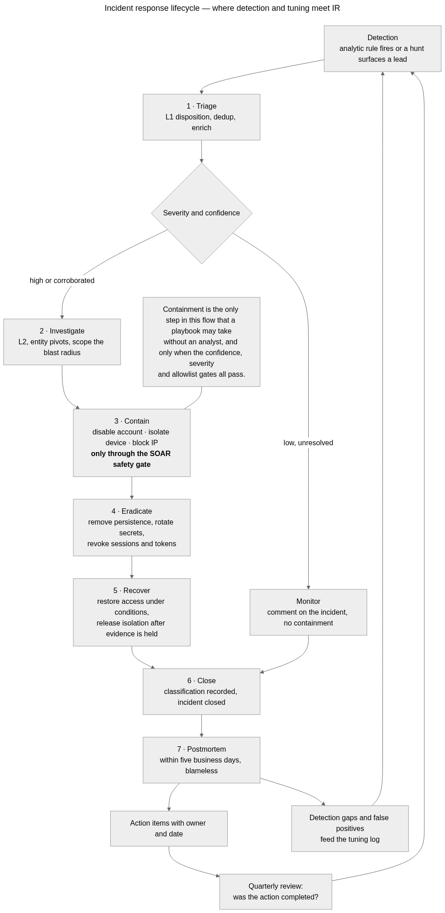

*Diagram* — The incident lifecycle the playbooks in `Playbooks/` are written against — detection, triage, containment decision, the safety gate that stops an unattended destructive action, verification, audit record and rollback — and where human authority is required rather than optional.

---

## ATT&CK

Coverage by tactic, the Navigator export, and the v19 domain change.

### `attack/01-coverage-by-tactic.png`

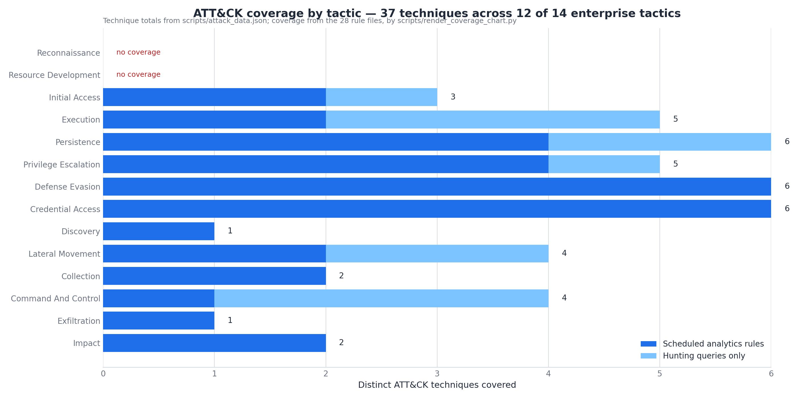

*Generated chart* — Coverage per ATT&CK tactic split by source — scheduled analytics rules versus hunting queries only — with tactics that have no coverage called out explicitly. The headline number (techniques, tactics covered) is the same number stated in `coverage.md`.

### `attack/02-navigator-export.png`

*Screenshot* — That the committed layer loads in a real Navigator session — the tab reads `sentinel-detection-engine coverage`, not a mock start screen — and that the techniques `coverage.md` reports are the ones highlighted on the matrix, including the Impact and Lateral Movement entries the six added rules contributed.

### `attack/03-attack-v19-domain-change.png`

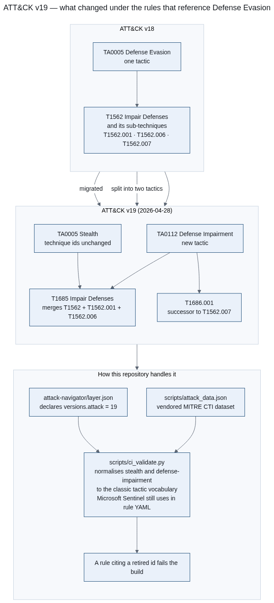

*Diagram* — What changed in MITRE ATT&CK v19 for Enterprise and how this repository absorbs it: Defense Evasion (TA0005) retires into Stealth (TA0005) and Defense Impairment (TA0112), T1562 and its sub-techniques merge into T1685, and T1562.007's successor is T1686.001. It also shows the compatibility decision — the layer declares v19 while the comparison code normalises the split tactics back to `DefenseEvasion`, so coverage counts stay comparable instead of silently dropping the techniques that moved.

### `attack/04-coverage-redundancy.png`

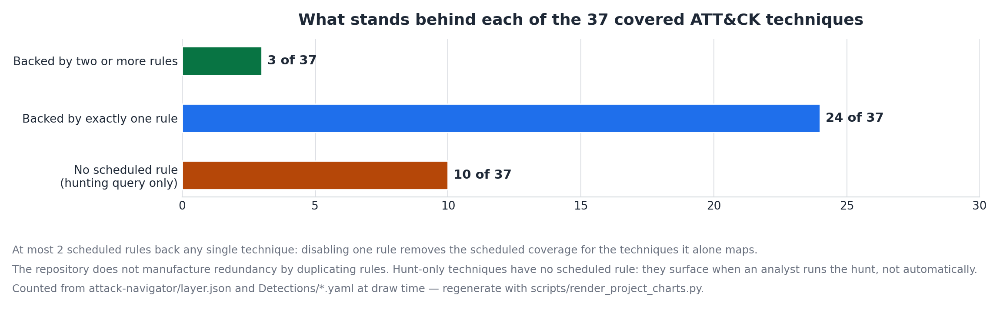

*Generated chart* — The depth behind the coverage number, which the per-tactic coverage chart does not show: of the 37 covered techniques, 24 are backed by exactly one scheduled rule, 3 by two rules, and 10 are covered only by a hunting query that an analyst has to run. It is drawn because a rule count is a coverage claim, and a coverage claim with no redundancy behind it is worth stating plainly — [`limitations.md`](../limitations.md) L4 does.

---

## Workbooks

The L3 triage dashboard: a data-free wireframe and a labelled sample-data preview.

### `workbooks/01-triage-dashboard-design-preview.png`

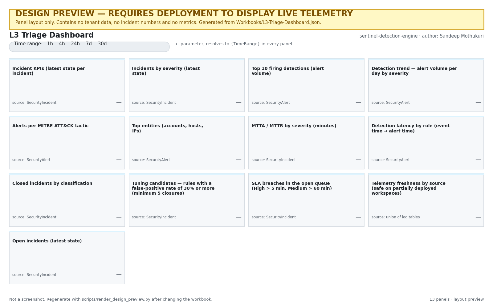

*Diagram (design preview)* — The panel layout of the workbook that is actually committed — 13 panels covering queue health, detection behaviour, analyst performance, and tuning/telemetry health — and which table each panel reads.

### `workbooks/02-triage-dashboard-sample-data.png`

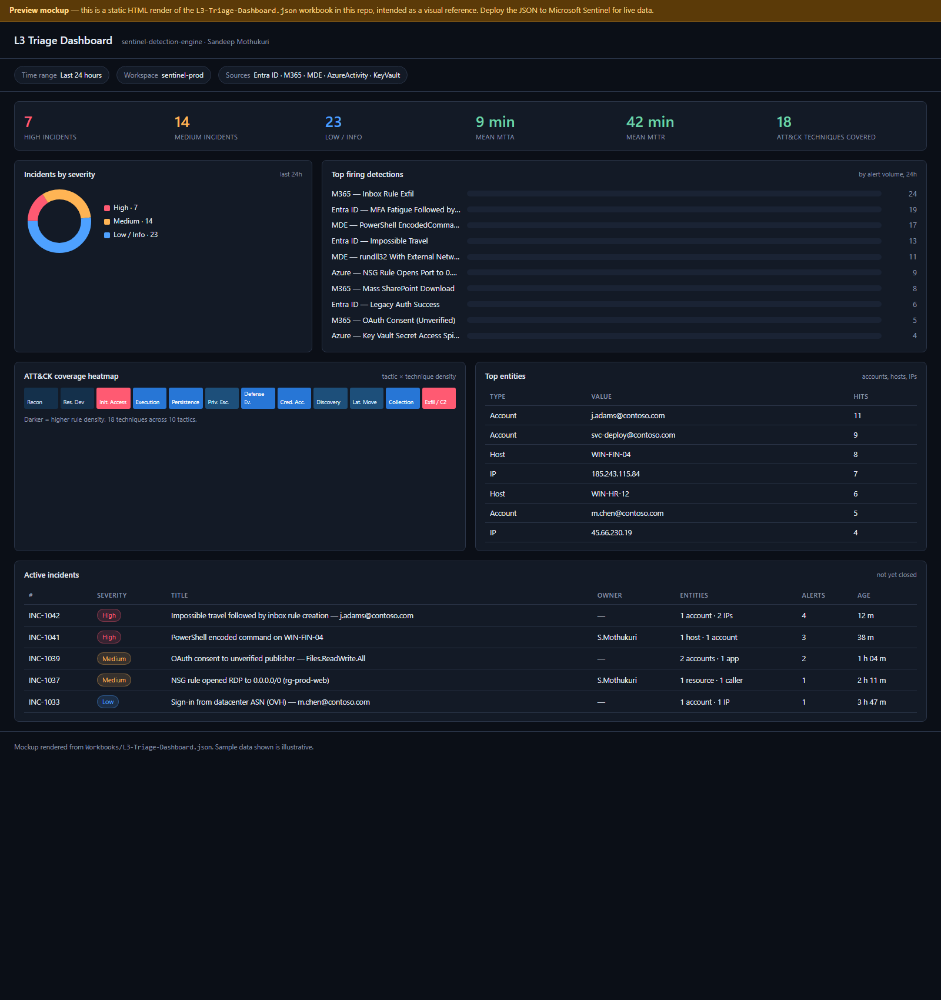

*Design preview (illustrative sample data)* — What the 13-panel workbook is intended to look like when it is deployed and carrying data — panel placement, the KPI strip, the severity donut, the top-firing-detections bar, the ATT&CK heatmap, the entity table and the active-incident queue. It demonstrates layout intent and nothing else.

---

## CI/CD

What runs on every commit, and what happens on a release.

### `ci-cd/01-validation-pipeline.png`

*Diagram* — The order of the checks a change must survive on the way to `main`, including the seven drift gates (coverage and layer, validation ledger, `deploy/`, quality matrix, workbook preview digest, generated charts, the image gallery) that fail the build when a generated artefact stops matching the files it is derived from. The sequence is the argument: nothing reaches the packaging step until the generated artefacts have been proven reproducible.

### `ci-cd/02-release-and-pr-automation.png`

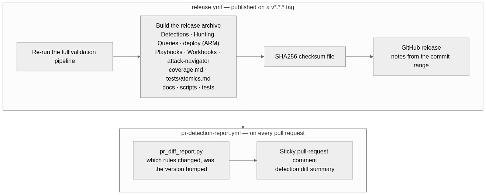

*Diagram* — That a release re-runs the entire validation pipeline rather than trusting the tagged tree, and that the pull-request path splits the job that runs contributor code (read-only) from the job that holds the comment permission (runs no contributor code, consumes only the uploaded artefact). The diagram lists what the release archive actually contains, including the generated `deploy/` templates.

---

## Social preview

The card GitHub shows when the repository is linked.

### `social/01-social-preview-card.png`

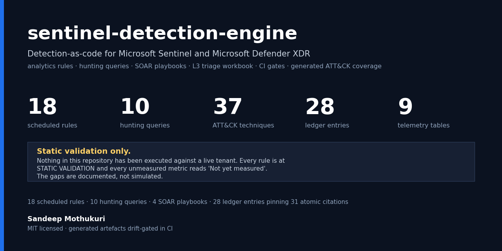

*Generated chart* — The repository's own counts as a preview card: 18 scheduled rules, 10 hunting queries, 37 ATT&CK techniques, 28 ledger entries, 9 telemetry tables, 4 playbooks and 31 atomic citations, every figure computed at draw time. It carries the same disclaimer the rest of this register does, in the image: **static validation only** — nothing in the repository has been executed against a live tenant, and every unmeasured metric reads `Not yet measured`. It is a card, not a console: it contains no fabricated alert, incident or metric, and nothing in it is dressed up as a screenshot.

---

## Not yet captured

These 9 shots are on the list and have **no image**. Each needs a live Sentinel tenant, a portal session and the redaction list in [`capture-guide.md`](capture-guide.md) — the guide gives the portal path and the intake command for every one of them.

| Shot | Area | Priority | What it would prove |
|---|---|:-:|---|
| `sentinel-incident-with-entities` | `sentinel` | 1 | A rule fired on real telemetry, produced the account, host and IP entities the playbooks consume, and rendered the custom alert details declared in its alertDetailsOverride block. |
| `soar-incident-comment-audit-trail` | `soar` | 2 | The playbook ran its gates and left the audit trail on the incident — confidence against threshold, the severity floor, the exclusion-list sizes and the rollback instruction. |
| `workbooks-triage-dashboard-live` | `workbooks` | 3 | The triage workbook binds to the declared tables and renders against real incident history, including the panels that are still empty. |
| `sentinel-analytics-rule-deployed` | `sentinel` | 4 | The generated ARM templates deploy — the rules exist in a workspace, enabled, with the severities and ATT&CK mappings the authoring YAML declares. |
| `soar-playbook-run-history` | `soar` | 5 | The safety gates are observable per run, including the accounts a gate skipped, which is the behaviour the documentation promises and a diagram cannot demonstrate. |
| `hunting-query-results` | `hunting` | 6 | A hunting query executes against its declared telemetry table and returns the columns and row shape its README describes. |
| `ci-actions-run-green` | `ci-cd` | 7 | The validation workflow runs on GitHub itself — the one CI claim a local reproduction cannot make and the reason a failing run must never be reported as green. |
| `sentinel-repository-connection` | `sentinel` | 8 | The GitOps deployment path documented in docs/deployment.md is the real one, consuming the generated ARM templates rather than the authoring YAML. |
| `detections-local-validation-run` | `detections` | 9 | The validator and the test suite run end to end on a real machine. Optional, and last on the list, because a green CI run supersedes it and a terminal capture is the easiest screenshot to fake. |

An empty panel is honest; a drawn one is not.
