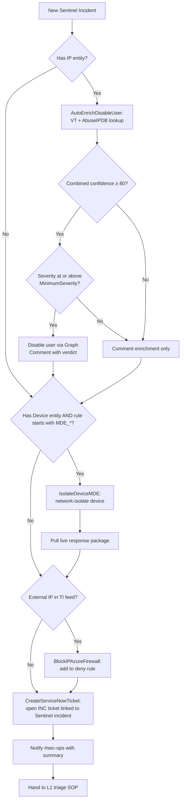

# SOAR Decision Flow

Every Sentinel incident in this pack is routed through the following decision pipeline. Logic App
playbooks live in `Playbooks/` and are bound to incident creation by Sentinel automation rules.

The governing rule, and the reason the pipeline has three gates rather than one:
**a query result alone never triggers a destructive action.** Enrichment and ticketing are safe and
run on every matching incident; containment requires a severity floor, a confidence threshold, an
independent corroborating signal, and a safety gate that checks for privileged or break-glass
accounts, excluded critical devices, allowlisted entities and unclear blast radius before it fires.
Those checks are parameters, not prose: `MinimumSeverity`, `PrivilegedUserPrincipals`,
`ExcludedUserPrincipals`, `ExcludedDeviceNames` and `AllowlistedIPs`, each asserted by
[`tests/test_playbooks.py`](../../tests/test_playbooks.py) so the JSON cannot drift away from this
flow. See [`../SOAR.md`](../SOAR.md) for the playbook
parameters and [`../../tests/validation/live-validation-guide.md`](../../tests/validation/live-validation-guide.md)
for the testing boundaries.

> The flow below is written in Mermaid, which GitHub renders. If you are reading this in a plain
> text viewer, the same flow is committed as an image at `../images/soar/01-soar-safety-gate-flow.png`.

## Top-level flow

## Per-rule automation matrix

| Rule | Auto-enrich | Auto-disable user | Auto-isolate device | Auto-block IP | Auto-ticket |
|---|:-:|:-:|:-:|:-:|:-:|
| EntraID_ImpossibleTravel | ✅ | ⚠️ at threshold | — | — | ✅ |
| EntraID_MFAFatigue | ✅ | ⚠️ at threshold | — | — | ✅ |
| EntraID_LegacyAuthSuccess | ✅ | — | — | — | ✅ |
| EntraID_ServicePrincipalCredAdd | — | — | — | — | ✅ (manual review only) |
| EntraID_PrivilegedRoleAssignment | ✅ | ⚠️ at threshold | — | — | ✅ |
| Azure_KeyVault_AccessControlChange | ✅ | — | — | — | ✅ (revert is manual) |
| M365_InboxRuleExfil | ✅ | ⚠️ at threshold | — | — | ✅ |
| M365_MassSharePointDownload | — | — | — | — | ✅ |
| M365_OAuthConsentSuspiciousApp | — | — | — | — | ✅ (revoke is manual) |
| MDE_LOLBin_Rundll32_Network | ✅ | — | ✅ | ✅ | ✅ |
| MDE_MSHTA_RemoteScript | ✅ | — | ✅ | ✅ | ✅ |
| MDE_PowerShell_EncodedCommand | ✅ | — | ✅ | — | ✅ |
| MDE_PsExec_ServiceExecution | ✅ | — | ⚠️ at threshold | — | ✅ |
| MDE_WinRM_RemoteExecution | ✅ | — | ⚠️ at threshold | — | ✅ |
| MDE_ShadowCopyDeletion | ✅ | — | ✅ | — | ✅ (containment is manual: restore is the priority) |
| MDE_Ransomware_MassFileRename | ✅ | — | ✅ | — | ✅ (containment is manual: restore is the priority) |
| Azure_NSG_OpenToInternet | — | — | — | — | ✅ (revert is manual) |
| Azure_KeyVault_SecretAccessSpike | ✅ | ⚠️ at threshold | — | — | ✅ |

⚠️ = action runs only when confidence threshold met; below threshold, playbook only enriches.

## Why "auto" stops where it does

Each row reflects a deliberate choice between **speed** and **reversibility cost**:

- **Enrich** — always safe, run everywhere.
- **Ticket** — always safe, run everywhere.
- **Isolate device** — reversible in seconds and low business impact for an L3-grade detection, so
  it may run automatically **after** the severity, confidence and device-exclusion gates. A host on
  `ExcludedDeviceNames` — a server, a domain controller, a hypervisor, a jump host — routes to
  analyst review instead, and the exclusion is matched on both the host name and the DNS name. The
  list is yours to populate: the playbook cannot tell a domain controller from a workstation, so an
  empty list means every host is eligible. A wrong isolation is cheap to undo but expensive in the
  fifteen minutes it is wrong.
- **Disable user** — annoying but reversible in minutes; require a confidence threshold. Accounts on
  `PrivilegedUserPrincipals` or `ExcludedUserPrincipals` are never auto-disabled, because the
  rollback for an administrator is not the same as the rollback for a mailbox user: the playbook
  names them in a skip comment and leaves the call to an analyst.
- **Revoke OAuth consent / revert NSG / kill workload** — high business impact, manual approval.

The threshold parameter on `AutoEnrichDisableUser` lets the SOC adjust risk tolerance without code changes.

## Rule-level automation binding

In Sentinel → **Automation → Automation rules**:

| Trigger | Condition | Action |
|---|---|---|
| Incident created | Rule name matches `MDE_*` | Run playbook `AutoEnrichDisableUser`, then `IsolateDeviceMDE` if the confidence and safety gates pass |
| Incident created | Rule name matches `EntraID_*` or `M365_*` | Run playbook `AutoEnrichDisableUser` |
| Incident created | Severity = High or Critical | Run playbook `CreateServiceNowTicket` |
| Incident created | Tag contains `tor` or `c2-known` | Run playbook `BlockIPAzureFirewall` |

Order matters: enrichment must precede containment so confidence scores are available for the
threshold decision. In practice, bind enrichment to incident creation and bind containment to
enrichment's output — never the other way round.

| New rule family | Automation binding |
|---|---|
| `EntraID_PrivilegedRoleAssignment`, `EntraID_ServicePrincipalCredAdd` | Enrichment and ticket only; role revocation is an analyst decision |
| `Azure_KeyVault_AccessControlChange` | Enrichment and ticket; revert the access policy by hand |
| `MDE_ShadowCopyDeletion`, `MDE_Ransomware_MassFileRename` | Enrichment, isolate at threshold, ticket; recovery is the priority, so the runbook takes over before any account action |
